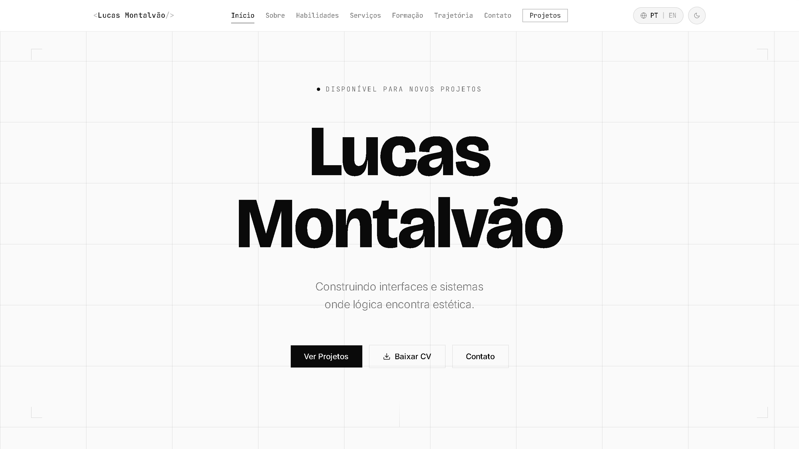

# 🚀 Portfólio Digital 2.0 — Lucas Montalvão

[](https://github.com/lucasmontalvao1619/Portf-lio-Digital-2.0/actions/workflows/ci.yml)



Meu portfólio profissional desenvolvido para apresentar projetos, pesquisas científicas, habilidades técnicas e experiências na área de Tecnologia da Informação.

O projeto foi construído com foco em performance, experiência do usuário e arquitetura moderna, combinando **React + TypeScript** no frontend, uma **Vercel Edge Function** para o formulário de contato via Resend, e uma **API ASP.NET Core** dedicada às estatísticas ao vivo do GitHub.

## 🌐 Sobre o Projeto

Este portfólio foi desenvolvido para centralizar minha trajetória acadêmica e profissional como estudante de Ciência da Computação, destacando:

* Projetos de desenvolvimento de software;
* Pesquisa científica e Iniciação Científica (PIBIC/CNPq);
* Habilidades técnicas;
* Tecnologias utilizadas;
* Experiências acadêmicas;
* Formulário de contato funcional com envio de e-mails;
* Seção de atividade no GitHub com dados ao vivo servidos pela API .NET.

---

## 🛠 Tecnologias Utilizadas

### Frontend

* React
* TypeScript
* Vite
* Tailwind CSS
* Lucide Icons
* React Router
* Vitest + Testing Library

### Backend (API .NET)

* ASP.NET Core 10
* C#
* Dependency Injection
* IHttpClientFactory + IMemoryCache
* Rate Limiting
* Response Caching
* CORS
* Validações Server-Side
* Testes unitários com xUnit
* Docker

### Serverless

* Vercel Edge Function (`/api/contact`)
* Resend API para envio de e-mails
* Honeypot + rate limit em memória

### Infraestrutura & Ferramentas

* Vercel (hospedagem do frontend e da function de contato)
* Render (hospedagem da API .NET via Docker)
* Git & GitHub
* GitHub Actions (CI: typecheck, builds e testes a cada push)
* VS Code / Rider

---

## 🏗 Arquitetura

```text
                 ┌──────────────────────────┐
                 │        Navegador         │
                 └────────────┬─────────────┘
                              │
       ┌──────────────────────┼──────────────────────┐
       │ HTML/CSS/JS (Vercel) │                      │
       ▼                      ▼                      ▼
┌─────────────┐   ┌────────────────────────┐  ┌────────────────────┐
│   Frontend  │   │  Vercel Edge Function  │  │    API .NET        │
│ React + Vite│   │  /api/contact          │  │  (Render, Docker)  │
│  (Vercel)   │   │  → Resend API          │  │  /api/github/stats │
└─────────────┘   └────────────────────────┘  │  /api/health       │
                                              └─────────┬──────────┘
                                                        │
                                                        ▼
                                              ┌────────────────────┐
                                              │   GitHub REST API  │
                                              │   (cache 10 min)   │
                                              └────────────────────┘
```

* **Formulário de contato:** o front chama `/api/contact` (mesma origem). A Edge Function valida input, aplica honeypot + rate limit e envia via Resend. Nenhuma chave vai para o cliente.
* **Estatísticas do GitHub:** o front chama `${VITE_DOTNET_BASE_URL}/api/github/stats`. A API .NET consulta o GitHub, agrega perfil / totais / top linguagens / top repositórios e cacheia em memória por 10 minutos.
* **Falha graciosa:** se a API .NET estiver dormindo (Render free) ou offline, a seção de GitHub simplesmente não é renderizada — o restante do site continua funcional.

---

## 📁 Estrutura do Projeto

```text
Portfolio-Digital-2.0/
├── .github/
│   └── workflows/
│       └── ci.yml               # CI: typecheck + testes + build do front, build + testes do back
│
├── frontend/
│   ├── api/                     # Vercel Edge Functions
│   │   ├── contact.ts           # POST → envia e-mail via Resend
│   │   └── health.ts            # GET  → sanity check + status das env vars
│   ├── src/
│   │   ├── app/
│   │   │   ├── data/            # traduções, projetos, skills, navegação
│   │   │   ├── features/        # seções: home/, contact/, projects/
│   │   │   ├── components/      # UI reutilizável (Reveal, SectionHeader...)
│   │   │   ├── layout/          # NavBar, Footer
│   │   │   ├── lib/             # hooks e utilitários (useInView, storage...)
│   │   │   └── pages/           # HomePage, ProjectsPage, ProjectDetailPage
│   │   └── styles/              # tailwind.css, theme.css, fonts.css
│   ├── public/
│   ├── package.json
│   ├── vite.config.ts
│   └── .env.example
│
├── backend/
│   ├── Portfolio.Api/
│   │   ├── Controllers/         # GitHubController, ContactController, HealthController
│   │   ├── DTOs/                # ContactRequest, GitHubStatsResponse
│   │   ├── Models/              # ContactEmailOptions, GitHubStatsOptions...
│   │   ├── Services/            # GitHubStatsService, EmailService, InputSanitizer
│   │   ├── Program.cs
│   │   ├── appsettings.json
│   │   └── dockerfile
│   └── Portfolio.Api.Tests/     # testes unitários (xUnit)
│
└── README.md
```

---

## ✨ Funcionalidades

### Interface

* Design moderno, minimalista suíço e responsivo
* Light/Dark mode
* Navegação suave entre seções
* Animações e transições sob rolagem (`Reveal`)
* Layout adaptado para desktop e mobile

### Portfólio

* Exibição de projetos com página de detalhe
* Tecnologias utilizadas em cada projeto
* Links para GitHub e Live Demo
* Informações acadêmicas e trajetória profissional

### Contato

* Formulário funcional via Vercel Edge Function
* Validação de campos client + server
* Honeypot anti-bot
* Rate limit por IP
* Envio de mensagens por e-mail via Resend

### Atividade no GitHub (via API .NET)

* Perfil (avatar, bio, seguidores)
* Totais agregados: repos, estrelas, forks
* Top linguagens (barras percentuais)
* Repositórios em destaque
* Cache server-side de 10 minutos (`IMemoryCache`)
* Response caching HTTP + rate limit por IP

---

## ⚙️ Executando o Projeto Localmente

### 1. Clonar o Repositório

```bash
git clone https://github.com/lucasmontalvao1619/Portf-lio-Digital-2.0.git
cd Portf-lio-Digital-2.0
```

### 2. Frontend

```bash
cd frontend
npm install
npm run dev
```

Aplicação disponível em `http://localhost:5173`.

Em modo de desenvolvimento o formulário aponta para o backend .NET local (`http://localhost:5272`). Se você quiser usar somente o frontend sem rodar o backend, exporte `VITE_API_BASE_URL=""` e teste a function via `vercel dev` (opcional).

### 3. Backend .NET

```bash
cd backend/Portfolio.Api
dotnet restore
dotnet run
```

API disponível em `http://localhost:5272`.

Endpoints:

```text
GET  /api/health          → sanity check
GET  /api/github/stats    → estatísticas agregadas do GitHub
POST /api/contact         → envio de e-mail (usa Resend)
```

### 4. Testes

```bash
dotnet test backend/Portfolio.Api.Tests/Portfolio.Api.Tests.csproj
```

Cobrem a sanitização de input (`InputSanitizer`) e a agregação de estatísticas do GitHub (`GitHubStatsService`: totais sem forks, percentual de linguagens, ordenação dos repositórios e cache).

```bash
npm --prefix frontend run test
```

Cobrem a Edge Function `/api/contact` (sanitização, honeypot, rate limit), o `ContactForm` (validação, envio, mensagens de erro) e `storage.ts`. Ambas as suítes rodam no GitHub Actions a cada push em `main`.

---

## 🔐 Variáveis de Ambiente

### Frontend (Vercel)

| Nome | Obrigatória | Descrição |
|------|:-----------:|-----------|
| `RESEND_APITOKEN` | ✅ | Chave da API do Resend, usada pela function `/api/contact`. |
| `CONTACT_FROM_EMAIL` | opcional | Remetente. Default: `Portfolio <onboarding@resend.dev>`. |
| `CONTACT_TO_EMAIL` | opcional | Destinatário. Default: `lucasmontalvao2019@gmail.com`. |
| `VITE_DOTNET_BASE_URL` | opcional | URL pública da API .NET no Render. Sem ela a seção de GitHub não aparece. |
| `VITE_API_BASE_URL` | opcional | Redireciona o formulário para um backend externo (fallback do legado). Se ausente, usa `/api/contact` da Vercel. |

### Backend (Render)

| Nome | Obrigatória | Descrição |
|------|:-----------:|-----------|
| `ASPNETCORE_ENVIRONMENT` | ✅ | `Production` no Render. |
| `CORS_ALLOWED_ORIGINS` | ✅ | Origens autorizadas separadas por vírgula (ex.: `https://lucdevv.vercel.app`). |
| `GITHUBSTATS__USERNAME` | ✅ | Usuário do GitHub cujas estatísticas são expostas. |
| `GITHUBSTATS__TOKEN` | opcional | Personal Access Token para aumentar o rate limit (60 → 5000 req/h). |
| `RESEND_APITOKEN` | opcional | Só necessário se você quiser servir o `/api/contact` do próprio .NET em vez da function. |

Um `.env.example` completo está em `frontend/.env.example`. **Nunca commite valores reais** — configure via Vercel/Render dashboards.

---

## 🚀 Deploy

### Frontend + Edge Function → Vercel

1. Importe o repositório no Vercel.
2. Configure o **Root Directory** como `frontend/`.
3. Adicione as env vars listadas acima.
4. Deploy automático a cada push em `main`.

### Backend .NET → Render

1. **New Web Service** apontando para este repo.
2. **Root Directory:** `backend/Portfolio.Api`, runtime **Docker** (auto-detectado pelo `dockerfile`).
3. Adicione as env vars listadas acima.
4. Anote a URL pública gerada e cadastre-a em `VITE_DOTNET_BASE_URL` na Vercel.

---

## 📚 Principais Aprendizados

Durante o desenvolvimento deste projeto foram aplicados conceitos de:

* Componentização com React;
* Gerenciamento de estado;
* Integração Frontend ↔ Backend via REST;
* Desenvolvimento de APIs com ASP.NET Core;
* Cache server-side com `IMemoryCache` e Response Caching;
* Consumo de APIs externas com `IHttpClientFactory`;
* Boas práticas de arquitetura e separação de camadas;
* Validação de dados e sanitização de input;
* Segurança em formulários web (honeypot, rate limit, CORS);
* Deploy híbrido (Vercel + Render + Docker).

---

## 👨‍💻 Autor

**Lucas Montalvão Gonçalves de Oliveira**

Estudante de Ciência da Computação pela Universidade Tiradentes (Unit).

Atuo com desenvolvimento de software, pesquisa científica e criação de soluções digitais voltadas para automação, produtividade e experiência do usuário.

### Contato

* GitHub: https://github.com/lucasmontalvao1619
* Portfólio: https://lucdevv.vercel.app

---

## 📄 Licença

Este projeto foi desenvolvido para fins acadêmicos e profissionais, servindo como demonstração de habilidades técnicas e evolução contínua na área de desenvolvimento de software.
